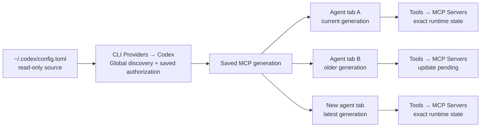
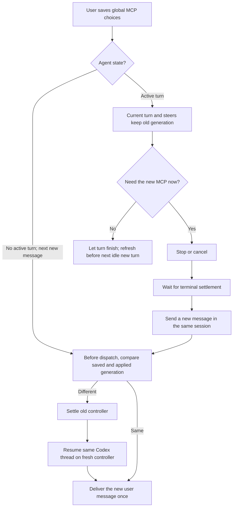

# Issue #830 MCP Bridge — Product Design System

Status: Phase 5 visual-design evidence. This document describes the accepted product boundaries and the state space that visual concepts must represent. It is not an implementation specification.

## Product promise

RepoPrompt lets a user choose which MCP servers from their ordinary Codex configuration are available to RepoPrompt's native Codex agents. Settings manages the global source and saved choices. Each Agent Mode tab shows whether that particular agent is using the latest saved choices.

The interface never displays or logs commands, URLs, arguments, environment values, headers, tokens, or full MCP definitions.

## Baseline observations

The current RepoPrompt CE Debug UI is a native dark macOS interface:

- CLI Providers contains an expandable Codex card. Its existing **MCP servers** subsection is the canonical global editor.
- The current row pattern is a server name, an optional compact qualifier such as **Required**, and a trailing switch.
- Agent Mode has a compact **Tools** popover anchored to the composer. It already contains an **MCP Servers** group and is the canonical per-agent runtime surface.
- Settings can become vertically dense. New MCP controls should use progressive disclosure and compact exception labels rather than a second card or duplicate editor.
- The Tools popover has limited width. Runtime state must remain scannable without long prose or a second popover.

Reference captures are in `../baseline/`. `agent-tools-single-pane.png` is the valid narrow-layout reference.

## Ownership model



Rules:

- Settings owns source discovery, draft choices, saved authorization, and source problems.
- Settings does not claim that all running agents are current, and v1 has no cross-window session count or session list.
- Each Agent Mode tab owns its exact applied generation, live connection state, and refresh action.
- Authorization identity is the exact case-sensitive server name. A separate semantic definition revision detects and applies every definition change without another authorization review, including timeout, URL, argument, and header changes.
- Newly discovered names are never silently authorized.

## Global Settings state model

### Section state

| State | Meaning | Primary treatment |
| --- | --- | --- |
| First review | Source was read, but no allow-list has been saved | Intro text, all rows unchecked, **Save Selection**; saving an empty selection is valid |
| Saved | Draft matches durable authorization | Quiet source summary and last-read time; Save disabled |
| Unsaved | One or more checkboxes differ from saved authorization | Persistent **Save Selection** and **Discard** actions |
| Source changed | File revision changed after the displayed draft was loaded | Non-destructive notice; refresh rows while preserving choices for names still present |
| Source unavailable | File is missing or cannot be read safely | Section-level error with **Retry**; keep saved names visible as unavailable |
| Source invalid | TOML cannot be safely interpreted | Section-level error; do not partially import definitions |

### Row state

Normal rows use only a checkbox and server name. Labels appear only for exceptions.

| Label | Meaning | Selectable? |
| --- | --- | --- |
| New | Discovered since the last saved review | Yes; off by default |
| Unsupported name | Codex runtime cannot accept the server name | No |
| Reserved name | Conflicts with RepoPrompt's required server | No |
| Name conflict | Two source entries cannot be represented safely | No |
| Turned off in your Codex config | Present but explicitly disabled in the ordinary Codex config | No until enabled at source |
| Not currently configured | Previously allowed name is absent from the source | No; removable from remembered choices |

Recommended copy:

- Heading: **MCP servers from your Codex config**
- Description: **Choose which servers RepoPrompt can make available to native Codex agents. RepoPrompt reads `~/.codex/config.toml` without changing it. Server details and credentials stay hidden.**
- Source line: **Source: `~/.codex/config.toml` · Read just now**
- Unsaved notice: **You have unsaved MCP choices. Running agents are unchanged until you save.**
- Source-error notice: **RepoPrompt couldn't read your Codex MCP configuration. Saved choices are unchanged.**

Ordinary unchecked rows carry no negative label because the checkbox communicates authorization. Plain-language negative labels are reserved for exceptional source and runtime states.

## Per-agent state model

### Section application state

| State | Meaning | Tools button | Popover header/action |
| --- | --- | --- | --- |
| Not started | No Codex controller is bound yet | Neutral | **MCP servers · Not started** |
| Current | Agent uses the latest saved generation | Neutral | **MCP servers · Current** |
| Update pending | Agent is on an older saved generation | Attention badge with icon/shape | **Update pending** + **Refresh** |
| Refreshing | Old controller is settling or a fresh controller is resuming | Progress indicator | **Refreshing MCP servers…** |
| Update failed | Replacement or an MCP start failed | Error badge with icon/shape | Concise error + **Try Again** |

### Server runtime state

| State | Meaning | Treatment |
| --- | --- | --- |
| Connected | Server is available in this tab | Check icon + **Connected** |
| Starting | Child process is starting | Spinner + **Starting** |
| Failed | Server failed to start or initialize | Error icon + **Failed** and privacy-safe detail affordance |
| Unavailable | Authorized definition cannot currently be used | Slash icon + **Unavailable** |
| Not present | Saved global choice is not part of this tab's applied generation | Minus icon + **Not present** |

The current Tools switch remains the runtime toggle. A row may also show a small **Pending** marker when its saved choice differs from this tab's applied generation.

## Message and refresh lifecycle



Important semantics:

- A steer modifies an active turn and stays on that turn's existing MCP generation.
- Delaying a steer until after controller replacement would change it into a future turn; the product must not silently do that.
- Existing queued follow-ups retain their current behavior. Visual design must not promise that they are automatically delayed or rebound.
- V1 does not add a generation-bound queue-after-refresh handoff. The one-delivery guarantee applies only to a genuinely idle new-turn send: refresh completes before that new turn is dispatched once.
- A fresh-controller resume preserves the Codex thread conversation, but restarts MCP child processes and ephemeral server state.
- Per-agent **Refresh** is available only for an existing Codex thread at a settled-idle boundary. During an active turn, the UI explains the Stop/Cancel path rather than pretending refresh is immediate.

## Responsive anatomy

### Settings — wide

```text
┌ Codex ─────────────────────────────────────────────────────────────┐
│ MCP servers from your Codex config                     [Refresh] │
│ Read-only explanation · source status                            │
│ ┌ Search/filter when the list is long ─────────────────────────┐ │
│ │ □ github                                      New             │ │
│ │ ☑ slack                                                       │ │
│ │ □ legacy.server                 Unsupported name              │ │
│ └───────────────────────────────────────────────────────────────┘ │
│ Unsaved/source notice                       [Discard] [Save]     │
└──────────────────────────────────────────────────────────────────┘
```

### Settings — medium and narrow

- Preserve the existing two-column Settings shell while it remains usable.
- Stack source metadata, Refresh, notices, and actions vertically inside the Codex card.
- Keep the checkbox and name on the first row; wrap an exceptional label beneath the name before truncating it.
- Keep **Save Selection** visible after the server list. Do not create a sticky full-window footer that obscures other provider settings.
- Use the server name as the tooltip/accessibility label when visual truncation is unavoidable.

### Agent Tools — wide

```text
┌ Tools ───────────────────────────────────┐
│ Bash                               [on] │
│ Search                             [on] │
├ MCP Servers · Update pending ───────────┤
│ slack        ✓ Connected        Pending │
│ github       − Not present              │
│                        [Refresh servers] │
└──────────────────────────────────────────┘
```

### Agent Tools — narrow or vertically constrained

- Keep one compact column; state text moves below the server name.
- Put the section action below the rows at full available width.
- The popover may scroll internally, but the section heading and current/pending state remain visible.
- Anchor to the Tools button without covering the send action when another placement is available.

## Accessibility and non-color cues

- Every state uses text plus an icon or shape. Green, yellow, and red never carry meaning alone.
- **Current**, **Update pending**, **Refreshing**, and **Update failed** are exposed as accessibility values on the Tools control and section.
- Checkboxes, switches, Refresh, Retry, Save, and Discard are keyboard reachable in predictable order.
- The focus ring follows native macOS conventions and remains visible against dark surfaces.
- Error badges expose a privacy-safe summary; they never expose server definitions.
- Animated progress respects Reduce Motion and has a static **Refreshing** label.
- Tooltips supplement truncated labels; they do not contain essential state unavailable to keyboard or assistive technology.
- Minimum pointer targets follow the current native row height even when icons are visually compact.

## Full design-state matrix

The refined mockup/prototype set must demonstrate:

1. Settings: first review, saved, unsaved, externally changed, new, removed, unsupported, reserved, name conflict, source-disabled, source unavailable, and invalid source.
2. Per-agent application: not started, current, update pending, refreshing, and update failed.
3. Per-server runtime: connected, starting, failed, unavailable, and not present.
4. Active turn: update pending with Stop/Cancel guidance.
5. Idle agent: Refresh available, in progress, successful, and failed.
6. Mixed generations: multiple tabs may legitimately show different application states while Settings remains global-only.
7. Responsive layouts: wide, medium, narrow, horizontal split, vertical split, and keyboard/focus behavior.

## Visual direction

Stay faithful to RepoPrompt's current native dark macOS vocabulary: layered charcoal surfaces, restrained separators, compact system typography, native controls, and small semantic badges. The differentiating motif is an unobtrusive **generation/status rail** inside the MCP section: a thin leading mark and concise state label that makes source authorization versus per-agent application visually distinct without adding a dashboard.

Avoid dashboard cards, decorative gradients, oversized headings, cross-session charts, and a second MCP editor under Agent Permissions.

## Verification plan

1. Compare every concept side-by-side with the seven real baseline captures for hierarchy, density, anchoring, and native control scale.
2. Run a state-coverage audit against every row in the full design-state matrix; a screenshot gallery must link each state to at least one frame.
3. Review wide, medium, and narrow frames for clipping, covered send controls, unreachable actions, and text that relies on hover.
4. Conduct a privacy copy audit: search exported text and inspect visible frames for commands, URLs, args, environment/header names, tokens, hashes, or raw definitions.
